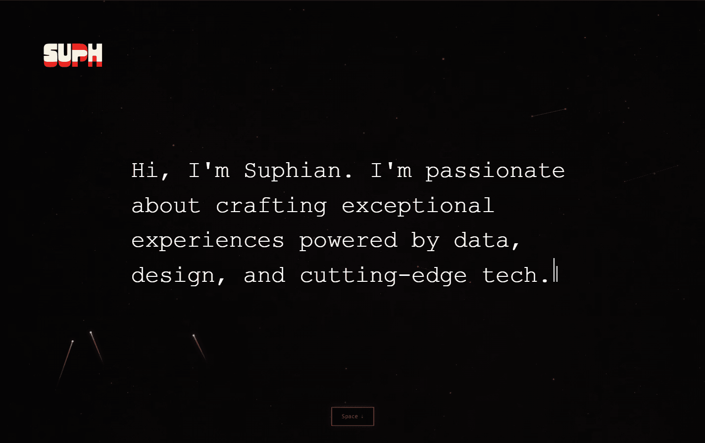
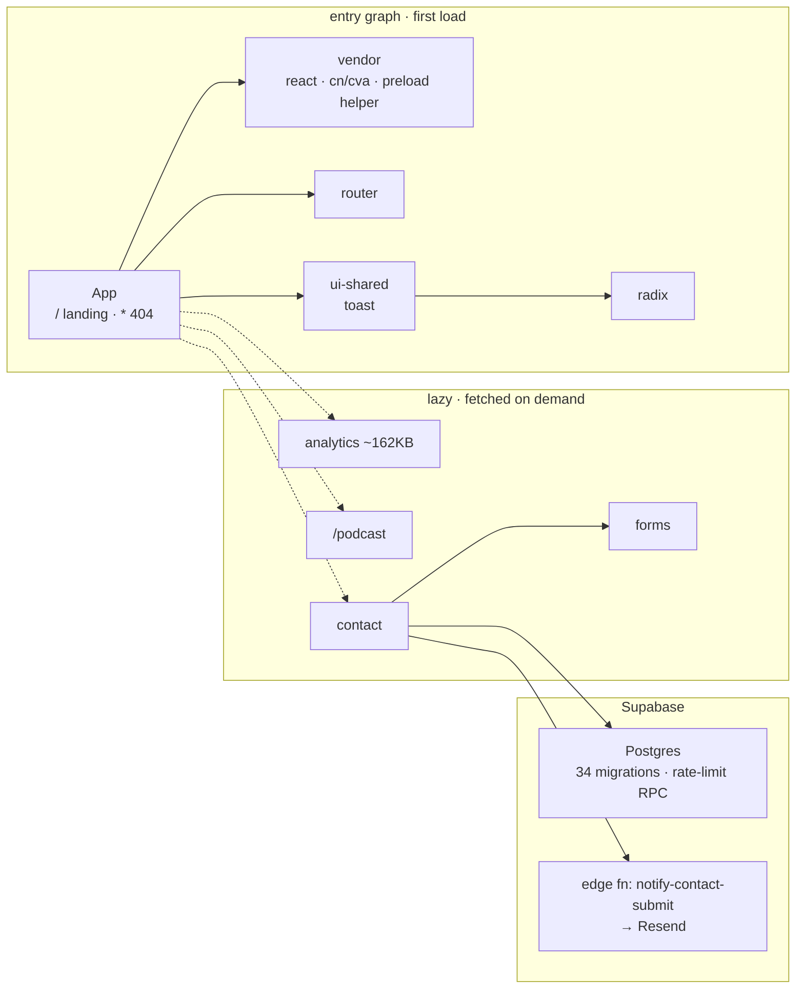

<p align="center">
  <a href="https://suphian.com">
    
  </a>
</p>

<h1 align="center">suphian.com</h1>

<p align="center">
  <a href="https://github.com/Suphian/suphian.com/actions/workflows/ci.yml"></a>
  
  
  
  
</p>

<p align="center">
  Personal site of <strong>Suphian Tweel</strong> — Senior Product Manager at YouTube (payments + AI).<br>
  Wired for first principles, allergic to fluff. The site is built the same way. → <a href="https://suphian.com"><strong>suphian.com</strong></a>
</p>

---

## `$ cat stack.txt`

```text
frontend    Vite 7.3.6 · React 18 · TypeScript · Tailwind · shadcn/ui (Radix)
routing     react-router-dom v7 — "/" and "*" eager, "/podcast" lazy
backend     Supabase — 1 edge function (notify-contact-submit → Resend), 34 migrations
analytics   15 first-party modules + GA4, deferred to first interaction or 3s
host        Vercel · CI: GitHub Actions — lint → typecheck → build, Node 20
deps        19 runtime · 19 dev · npm audit: 0 vulnerabilities
```

## `$ npm run dev`

```bash
git clone https://github.com/Suphian/suphian.com.git
cd suphian.com
npm install
npm run dev          # http://localhost:8080
```

No secrets needed to run it. `.env.example` documents the Supabase publishable values for reference; the client currently hardcodes them.

```text
dev              dev server on :8080
dev:open         dev server, opens a browser
dev:host         dev server with an explicit --host
build            production build
build:dev        development-mode build
build:analyze    build + interactive treemap at dist/stats.html
preview          serve the production build
preview:local    serve the production build, port pinned to 8080
lint             eslint  (lint:fix to autofix)
typecheck        tsc --noEmit — the same gate CI runs
optimize:images  regenerate public/ derivatives from assets-src/ with sharp
```

CI runs on pushes to `main` and on every pull request. Branch and deploy workflow: [CONTRIBUTING.md](CONTRIBUTING.md).

## `$ ls features/`

- **Typing hero** — cycles a greeting through 18 languages, Arabic included, with real RTL direction.
- **Press `Space`** — plays a recording of how *Suphian* is actually pronounced. Guarded so it never hijacks Space on a button, a link, or while you're typing in a field.
- **Canvas starfield** — honors `prefers-reduced-motion`, throttled to 30fps, pauses on tab hide, particle count capped.
- **Activity panel** — a live view of *your own* session engagement, in the nav. Built on the first-party analytics, not a third-party widget.
- **Podcast** — an AI-generated episode about YouTube's payments problem.
- **404** — looping SUPH logo animation, also gated on `prefers-reduced-motion`.
- **PWA service worker** — build id stamped into `CACHE_NAME` at build time, so a deploy evicts the old caches.

## `# engineering notes`

**Bundle.** Analytics (~162KB), contact, and forms are lazy chunks, and the DEV-only debug overlay is gated at the import site so it never enters the production entry graph. First-load JS came down by roughly half.

The non-obvious part is what has to be *pinned*. Styling foundations (`cn`/`cva`), the toast primitives, and Vite's dynamic-import preload helper are shared by eager and lazy code. Left alone, Rollup colors them into a lazy chunk — which then becomes a static dependency of the entry and quietly undoes the split. `ui-shared` gets its own chunk instead of folding into `vendor`, because it imports from `radix` and the merge creates a `vendor`↔`radix` cycle that breaks React init.

<details>
<summary>The chunk graph the split is tuned around — <code>npm run build:analyze</code> checks it</summary>



</details>

**Deliberately on Vite 7, not 8.** Vite 8 is Rolldown-based and collapsed the tuned graph: the contact chunk went 84KB → 304KB and the forms chunk disappeared entirely. Staying put until that's fixable.

**SEO.** Static meta + JSON-LD in `index.html` is the single source of truth for crawlers. A runtime `SEOHead` component updates title, canonical, and OG per route for JS clients. Unknown routes get `noindex`.

**Security.** Enforcing Content-Security-Policy plus the full header set — `X-Frame-Options: DENY`, nosniff, `Referrer-Policy`, `Permissions-Policy`, HSTS — configured in `vercel.json`. The contact form pairs zod validation and a honeypot with server-side rate limiting through a Postgres RPC: client validation is UX, not a control.

**Images.** Editable masters live in `assets-src/`, outside `public/`, because everything in `public/` ships to the CDN verbatim. `scripts/optimize-images.mjs` generates the derivatives with sharp.

**Hygiene.** `noUnusedLocals` / `noUnusedParameters` and `no-unused-vars` are enforced, with the typecheck gate in CI, so dead code can't quietly accumulate.

## `$ tree -d`

```text
src/app            App shell, routing
src/features       landing · contact · podcast
src/pages          NotFound
src/shared         components · hooks · lib · utils/analytics (15 modules)
src/integrations   supabase client
supabase           functions/notify-contact-submit · 34 migrations
scripts            optimize-images.mjs
assets-src         editable image masters — never shipped
public             shipped to the CDN verbatim
```

## `$ cat theme.css`

```text
background   near-black
accent       #B82E2E   hsl(0 60% 45%)   — oxide red, the only accent
accent-text  #D24B4B                    — lighter, clears WCAG AA on black
type         IBM Plex Mono everywhere · Montserrat for headings
```

---

<p align="center">
  <br>
  <sub>© Suphian Tweel</sub>
</p>
